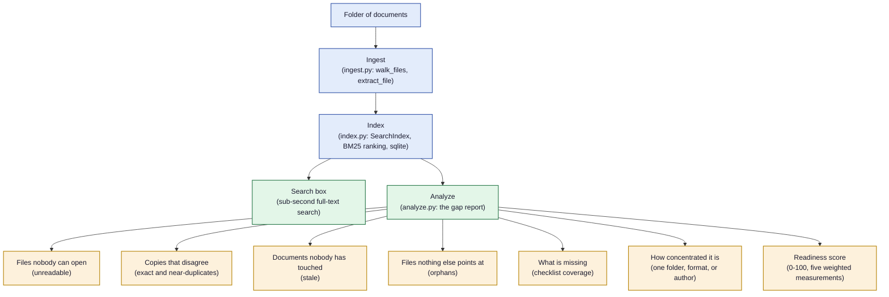

# Bindery

Point it at a folder of documents and get sub-second full-text search plus a
report on what is wrong with the pile.

[](https://www.python.org/)
[](delivery/bindery)
[](LICENSE)
[](https://github.com/blaine-hiers/Bindery/actions/workflows/ci.yml)

It reads every file, indexes every word, and gives you two things: a search
box that finds anything in the pile in well under a second, and a report on
what is wrong with the pile — what is duplicated, what nobody has touched in
years, what nothing references, what nobody can open, and what a business that
size should have written down and does not.

No dependencies. No installer. No network. `py delivery/bindery/app.py` opens
a browser and it runs on the standard library, on a folder on your own disk.

## Quickstart

```
py delivery/bindery/app.py        # opens in your browser
py run_all_tests.py               # 247 tests
```

Windows: double-click `run.cmd`.

| Flag / variable | Where | What it does |
|---|---|---|
| `-v` | CLI flag, e.g. `py delivery/bindery/app.py -v` or `run.cmd -v` | Verbose: prints what the server is doing |
| `BINDERY_DATA` | Environment variable | Overrides where the sqlite data lives. Defaults to `data/` beside the app; tests point it somewhere temporary |

## How it works



A folder goes in once, through **ingest** (`ingest.py`) and **index**
(`index.py`). Everything after that reads from the index, not the folder, and
splits into the two outputs the tool exists for: the **search box**, and
**analyze** (`analyze.py`), the gap report.

## What it actually does

**Ingest.** Walks a folder and pulls text out of `.docx`, `.pdf`, `.xlsx`,
`.md`, `.txt`, `.csv`, `.html` and a few others, including the awkward ones —
PDFs with subset fonts, files that lie about their encoding, documents whose
declared type and actual bytes disagree. Anything it could not read is
**listed**, not skipped. A file that quietly vanishes from an index is worse
than one that is missing loudly.

**Index.** A full-text index built by hand on top of sqlite: tokenising,
stemming, ranking. Search returns matches with the surrounding sentence, so you
can see why something matched before you open it.

**The gap report.** This is the part that is worth something. Given a pile of
documents it will tell you:

| Finding | What it means |
|---|---|
| **Copies that disagree** | Exact and near-duplicate documents — the same procedure saved four times with three different dates on it. "Near" means most of the five-word runs in two files are the same. |
| **Documents nobody has touched** | Stale, bucketed by age: under a year, one to three years, three to five, over five. |
| **Files nothing else points at** | Orphans — nothing references it and it references nothing (by name match). |
| **Files nobody can open** | Unreadable — locked, damaged, a scan, or an old format — listed with the reason, never silently dropped. |
| **What is missing** | Measured against a checklist you can edit, because what a business ought to have written down depends on the business. |
| **How concentrated it is** | How much sits in one folder, one file type, or one person's name — a people risk, not a filing risk. |

Every finding names the files it came from. No finding is reduced to a single
number. **The readiness score** weighs five measurements — readable (25),
current (20), unique (15), covered (25), spread (15) — and lands at one of
four maturity levels: "In good shape" (80+), "Workable, with real gaps" (60+),
"Needs work before it can be relied on" (40+), or "Not something the business
can lean on yet". When a measurement cannot be worked out, it drops out and the
score comes back out of what remains. Every figure shows its arithmetic.

## Design notes

- **Read-only on your documents.** The scan opens files in `r` mode and writes
  nothing back to the folder it is pointed at. The index lives in `data/`
  beside the app.
- **`data/` never leaves the machine and is not in this repo.** It is a sqlite
  database of whatever you scanned.
- **Findings show their arithmetic.** Each finding names its files and counts.
  The readiness score is a single number, backed by a table of five weighted
  measurements. No single-point figure without visible arithmetic.
- **Nothing is filtered away.** Everything found is kept and ordered. A tool
  that quietly drops what it judged uninteresting narrows what you know without
  telling you.

Longer notes on the ingest edge cases and the scoring live in
[`delivery/bindery/README.md`](delivery/bindery/README.md).

## Layout

```
_shared/            server, storage and design system (vendored — see below)
delivery/bindery/   the app
tests/              247 tests, mirroring the app tree
```

`_shared/` is vendored from a larger private workspace of about twenty of these
apps that share one server base, one storage layer and one visual language. The
two-level `delivery/…` path is not decoration: the folder an app sits in decides
its colour, and the test tree mirrors the app tree exactly. Its comments
occasionally mention sibling apps that are not in this repo.

`tests/test_publishable.py` guards the seam between that private workspace and
this one — it fails if a copied file brings private fixture data back with it.

## Licence

MIT. See [`LICENSE`](LICENSE).
